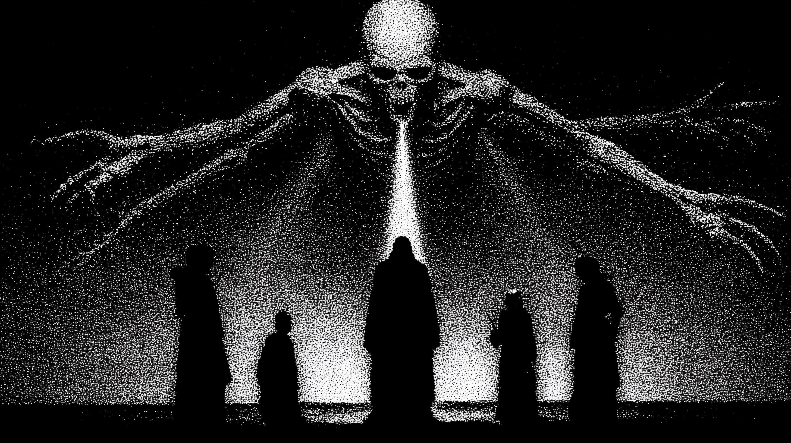

# DarkReach

DarkReach is an advanced open-source tool designed for cybersecurity professionals to perform deep network reconnaissance and vulnerability assessment. It leverages cutting-edge techniques to identify potential security weaknesses in target systems, providing detailed reports and actionable insights.

## How it Works ?

DarkReach is a Rust based system that allow users to setup and configure a C2 server to manage multiple agents deployed on target systems. The agents communicate with the C2 server to receive commands and send back results, enabling remote control and data collection.

This tools is designed to create attack patern with YAML configuration files, allowing users to define specific reconnaissance and exploitation tasks. The agents can perform a variety of actions, including network scanning, vulnerability detection, data exfiltration, and more.

### Components
- **C2 Server**: The central command and control server that manages agents and orchestrates
- **Agents**: Lightweight clients deployed on target systems to execute commands and report back to the C2 server.
- **CLI**: A command-line interface for users to interact with the C2 server and manage agents.